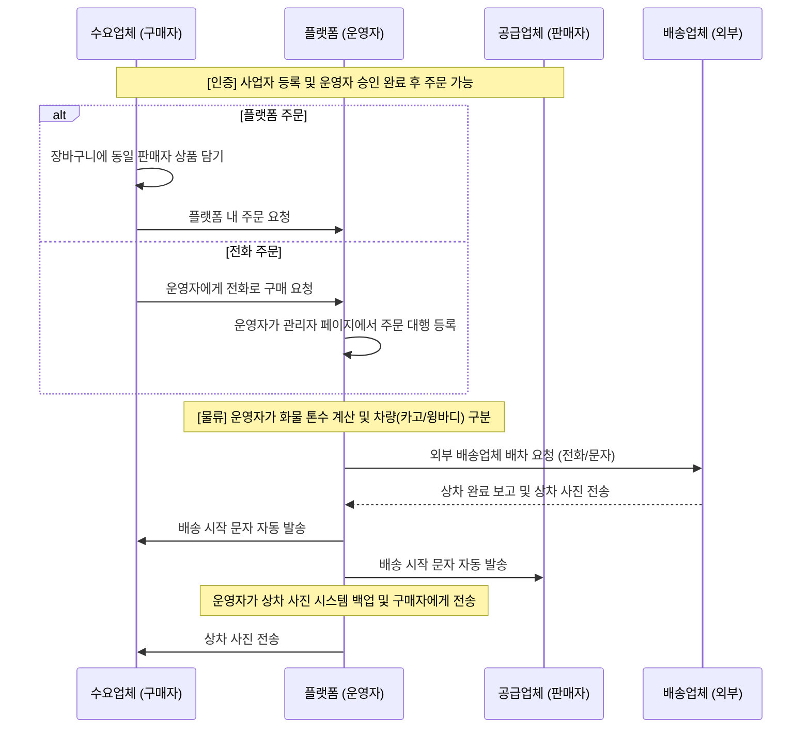

## 1. 서비스 개요 및 전략

* **서비스명**: 가설재/유로폼 특화 B2B 중개 플랫폼.
* **핵심 전략**:
  * 아날로그(전화)와 디지털(플랫폼) 주문의 완벽한 병행.
  * 연령층이 높은 사용자를 고려한 **'무옵션 상품'** 체계 (1개 품목 = 1개 상품).
  * **동일 판매자 상품에 한해 장바구니 다중 담기 가능**.
  * 운영자가 물류(배차/톤수)와 정산을 직접 중개하여 신뢰도 확보.

---

## 2. 사용자 유형 및 권한 관리

| 구분 | 역할 및 권한 상세 | 시스템 이용 범위 |
| --- | --- | --- |
| **수요업체(구매자)** | 상품 검색, 장바구니 담기, 플랫폼 주문, 입금 확인, 세금계산서 수령. | 로그인 시: 구매 전용 메뉴(마이페이지/주문내역) 비로그인: 상품 조회만 가능 |
| **공급업체(판매자)** | 상품 등록 및 재고 관리, 판매 중단, 정산 대금 수령. | 로그인 시: 판매 전용 메뉴(상품관리/정산내역) **[가정]** 판매자와 구매자는 상단 GNB를 공유하되, 세부 메뉴 권한만 분기 처리함. |
| **운영자(Admin)** | **전화 주문 대행**, 화물 톤수 계산, 배차 요청, 상차 사진 백업/전송, 정산 총괄, 상품 승인 및 수정. | **[별도 URL]** `/admin` 접속 시 분리된 관리자 전용 레이아웃 및 메뉴 노출. |
| **배송업체(차주)** | 운영자의 요청에 따른 상차 및 배송 수행. | **외부 협력자** (시스템 미접속, 유선 소통) |

> **[논의 필요 / 개발 가정]**
> * **메뉴 동적 관리**: 현재는 코드 레벨에서 정적으로 권한별 메뉴를 제어함. (CMS 형태의 동적 메뉴 관리는 추후 고려)
> * **권한 변경**: 사용자가 관리자로 승격되거나, 로그인 중 권한이 변경되는 케이스는 고려하지 않음. (관리자는 DB/백오피스에서 별도 생성)
> * **인증 필수 구간**: `상품 등록` 및 `주문 진행` 프로세스는 토큰(Session)이 없으면 강제로 로그인 페이지로 리다이렉트.

### **시스템 필수 메뉴 상세**
* **일반 사용자 (판매자/구매자)**
  * **상품 목록**: 모든 사용자 접근 가능.
  * **상품 등록**: 판매자 권한 필요.
* **관리자 (Admin)**
  * **주문 관리**: 운영자가 접수된 주문, 배차, 상차 확인 등을 총괄.
  * **사용자 관리**: 회원가입 승인, 사업자 정보 검수 등.

---

## 3. 회원가입 및 인증 프로세스 (승인제)

### **가입 절차**
* **가입 로직**: ID/PWD 방식 (소셜 로그인 X). ID 중복 확인 + **대표 연락처 인증** 필수.
* **사업자등록번호**: 회원가입 시 필수 입력 항목.
* **서비스 권한**: 
  * 가입 즉시 로그인은 가능하나, **사업자등록증 업로드 및 운영자 승인** 전까지는 주문 등 거래 기능 이용 불가.
  * 비로그인 사용자도 **상품 목록 조회는 가능**.

### **사업자 관리**
* 한 계정으로 **여러 개의 사업자등록증** 등록 가능 (최소 1개 승인 시 서비스 활성화).
* 사업자 정보(주소 등) 변경 시 **운영자 승인**이 있어야 반영됨.
* 운영자가 문자로 받은 사업자등록증을 대신 등록해 줄 수 있는 대행 기능 포함.

### **동시 접속**
* 한 계정으로 여러 단말기에서 **동시 접속 허용**.

---

## 4. 상품 및 카테고리 체계 (실무 로직 반영)

### **분류 체계 (Depth 3)**
*   **가설재**: 구분 > 품목 > 규격 (상태: 신재, 고재)
*   **유로폼**: 구분(유로폼) > 품목(신재, 쇼트신재, 쇼트뒤집기, 고재) > 규격(1200, 900, 600 등)
*   *유로폼은 일반 가설재보다 복잡한 '품목(쇼트/뒤집기 등)' 단계를 포함함.*

### **상품 등록 규칙**
*   **필수 필드**:
    *   **[삭제됨]** 상차지 주소 (판매자 정보에서 자동 로딩)
    *   **상품 유형**(신재/고재/주문제작)
    *   판매 단위(참고용)
    *   수량(단위 무관 입력 가능)
    *   단가, 금액
    *   사진(최소 3장 이상)
*   **등록 프로세스**:
    *   판매자가 상품 등록 시 **운영자 승인** 필수.
    *   승인 전까지는 상품이 플랫폼에 노출되지 않음.
*   **특이사항**:
    *   상품은 옵션을 가지지 않음(1개 품목=1개 상품).
    *   상품 상세 페이지에서 **해당 판매자의 다른 판매 상품**도 함께 노출.

### **재고 관리 로직 (유형별 정책)**
1.  **신재 (New)**
    *   재고의 **증가(+) / 감소(-)** 자유로움.
    *   지속적으로 물량을 채워 넣으며 판매 가능.
2.  **고재 (Used)**
    *   재고의 **감소(-)**만 가능. **증가(+) 불가**.
    *   이유: 고재는 매입 시점마다 상태가 다르므로, 물량이 추가되면 기존 상품 재고를 늘리는 게 아니라 **새로운 상품**으로 등록해야 함.
    *   **[가정]** UI에서 고재 상품 수정 시 재고 입력 필드는 비활성화하거나, 증가 시도 시 에러 처리.
3.  **주문제작 (Custom)**
    *   로직은 '신재'와 유사하나, **초기 재고가 0**임.
    *   **제작 소요 기간** 명시 필요. (주문 접수 -> 제작 -> 출고)

> **[논의 필요]**
> *   **고재 품절 처리**: 재고가 0이 되면 자동으로 '판매 종료' 상태로 변경할지, '품절' 배지를 띄우고 노출은 유지할지 결정 필요. (현재는 자동 품절 처리 가정)

### **상품 수정 규칙**
  * 판매 중단 설정 가능.
* **운영자 권한**:
  * 모든 상품 정보(가격, 재고, 이미지 등) **수정 가능**.

### **상품 노출 규칙**
* **주소 노출**: 판매자에 귀속된 상차지 주소를 시/구 단위까지만 표시 (예: 대전시 유성구).
* **상세주소**: 주문 확정 후 거래 당사자에게만 공개.

---

## 5. 장바구니 및 주문 시스템

### **장바구니 기능**
* 한 주문에 **여러 상품** 담기 가능.
* **제약사항**: 
  * 장바구니에는 **동일 판매자의 상품만** 담을 수 있음.
  * A 판매자 상품이 담긴 상태에서 B 판매자 상품 추가 시도 시:
    * 기존 장바구니 비우기 후 추가 가능 (배달의민족 방식).
    * 사용자에게 명확한 안내 메시지 제공.

### **주문 방식**
* **플랫폼 주문**: 구매자가 직접 장바구니에서 주문.
* **전화 주문**: 운영자가 관리자 페이지에서 주문 대행 등록.

---

## 6. 주소 및 배송지 관리

### **주소 체계**
* **지도 API 활용**: 모든 주소는 지도 API를 통해 입력하여 일관성 확보.
* **주소 구분**:
* **상차지 주소 관리**:
   * **원칙**: 상차지는 상품이 아닌 **판매자(User)에게 귀속**된다.
   * **제약**: 판매자 1명당 **단 하나의 상차지**만 등록 가능.
     * **[논의 필요]** 판매자가 2개 이상의 야적장을 운영할 경우? 현재는 계정을 분리(판매자1, 판매자2)해야 한다고 가정.
   * **스냅샷(Snapshot)**: 
     * 주문이 생성되는 시점의 상차지 주소(우편번호, 기본주소, 상세주소)를 **주문 데이터(Order)**에 복사하여 영구 저장.
     * 판매자가 이사를 가서 회원정보의 주소를 바꿔도, **과거 주문 건의 상차지 정보는 변하지 않음**.
  * **배송지**: Entity로 별도 관리 (사용자 편의를 위한 주소록 기능).

### **배송지 관리**
* 구매자는 자주 사용하는 **배송지를 등록/관리** 가능.
* 주문 시 등록된 배송지 중 선택하거나 새로 입력.
* 주문 완료 시 상/하차지는 **스냅샷으로 저장** (이후 주소 변경에 영향받지 않음).

---

## 7. 주문 및 물류 상세 플로우

---

## 8. 정산 및 문서 발행 로직

* **정산 단계**: 구매자 입금(운영자 계좌) → 운영자가 판매자/배송업체에게 각각 정산.
* **세금계산서**: 운영자가 국세청을 통해 수동 발행.
* **거래명세서 자동화**:
  * 시스템에서 **거래명세서 양식**에 데이터를 채워 구매자에게 이메일 발송.
  * 발송 시 **운영자의 통장 사본**을 반드시 함께 첨부.

---

## 9. 주요 관리 및 마이페이지 기능

### **비밀번호 관리**
* **로그인 전**: 휴대폰 인증을 통한 비밀번호 초기화(임시 비밀번호 발송) 가능.
* **로그인 후**: 직접 비밀번호 재설정.

### **판매자 전용 기능**
* **판매 관리**: 자신이 올린 상품의 판매 진행 상황(주문/상차 등)을 확인할 수 있는 전용 화면 제공.
* **상품 관리**: 가격 수정, 판매 중단 설정.

### **구매자 전용 기능**
* **배송지 관리**: 자주 사용하는 배송지 등록/수정/삭제.
* **주문 내역**: 주문 상태별 조회 및 거래명세서 확인.
